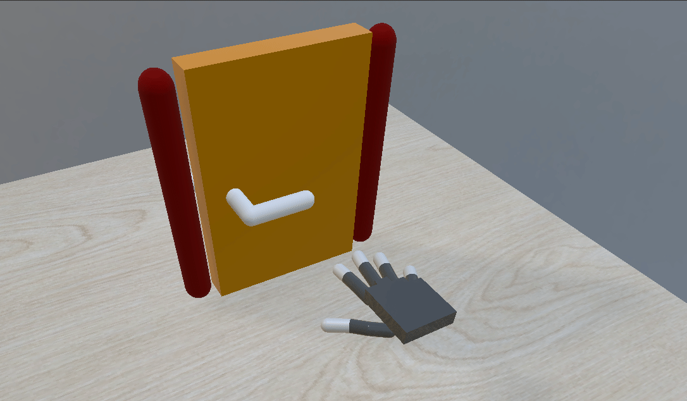
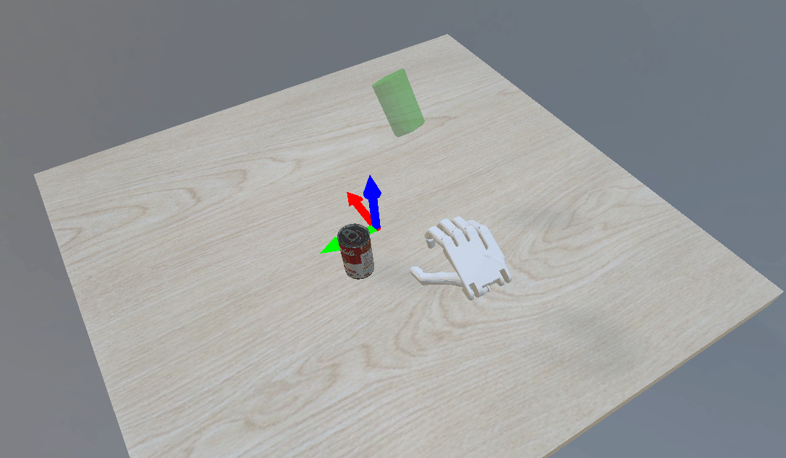

# From One Hand to Multiple Hands: Imitation Learning for Dexterous Manipulation from Single-Camera Teleoperation

[[Project Page]](https://yzqin.github.io/dex-teleop-imitation/) [[Paper]](https://arxiv.org/abs/2204.12490) [[Slides]](https://docs.google.com/presentation/d/186iJVvY9B0D_KSKKQFV1ketIKiTK1L_A/edit?usp=sharing&ouid=108317450590466198031&rtpof=true&sd=true)
-----

[From One Hand to Multiple Hands: Imitation Learning for Dexterous Manipulation from Single-Camera Teleoperation](https://yzqin.github.io/dex-teleop-imitation/)

Yuzhe Qin, Hao Su*, Xiaolong Wang*, RA-L & IROS 2022.

Here we provide a simple system for teleoperation with dexterous hand in simulation, as well as a conversion between
MANO/SMPL hand format and simulatable robot model (.urdf) format


## Installation

```shell
git clone git@github.com:yzqin/dex-hand-teleop.git
cd dex-hand-teleop 
conda create --name dexteleop python=3.8
conda activate dexteleop
pip install -e .
```

Download data file for the scene
from [Google Drive Link](https://drive.google.com/file/d/1Xe3jgcIUZm_8yaFUsHnO7WJWr8cV41fE/view?usp=sharing).
Place the `day.ktx` at `assets/misc/ktx/day.ktx`.

```shell
pip install gdown
gdown https://drive.google.com/uc?id=1Xe3jgcIUZm_8yaFUsHnO7WJWr8cV41fE
```

### Download additional weights for hand detection

Follow the guidelines provided by
the [FrankMocap](https://github.com/facebookresearch/frankmocap/blob/main/docs/INSTALL.md)
project to download the weight files for the SMPLX hand model and hand pose detector.

Please note that you only need to obtain a subset of the files utilized in the original FrankMocap repository. If the
process is completed successfully, the final file structure should appear as follows within
the `hand_detector/extra_data` directory. Some weights required by FrankMocap is not necessary for this repo if not
listed below.

```shell
├── extra_data
│   ├── hand_module
│   │   ├── mean_mano_params.pkl
│   │   ├── pretrained_weights
│   │   │   └── pose_shape_best.pth
│   │   └── SMPLX_HAND_INFO.pkl
│   └── smpl
│       └── SMPLX_NEUTRAL.pkl
```

## File Structure

- `hand_teleop`: main content for the environment, utils, and other staff needs for simulation. It utilizes the same
  code
  structure as [DexPoint](https://github.com/yzqin/dexpoint-release).
- `hand_detector`: perception code and model to detect hand bbox and regress hand pose in SMPLX format
- `assets`: robot and object models, and other static files
- `example`: entry files to learn how to use the teleoperation and the customized robot hand

## How to Use

### Use the `customized robot hand` proposed in the paper

Run [example/customized_robot_hand.py](example/customized_robot_hand.py) to learn how to construct and control a robot
hand based on SMPLX hand parameterization.

### Replay the collected demo and generate observation-action trajectory

Run [example/simple_replay.py](example/simple_replay.py) to visualize the provided
`example_teleop_data` for each task. It simply replays the demonstration without modification, i.e. visualize the saved
demonstration trajectory without retargeting and generating anything.



Run [example/replay_generate_bc_data.py](example/replay_generate_bc_data.py) to visualize the **processed**
`example_teleop_data` for each task. It replays the demonstration **after retargeting** and generate the state-action
trajectory that can be consumed by imitation learning algorithms.



### Use the teleoperation system to collect some demo

Before running the teleoperation demo, make sure that your computer are connected to an iPhone and iPad, and
the [Record3D app](https://github.com/marek-simonik/record3d) are installed on your device. I am really sorry that the
current teleoperation code requires USB connection to the iPad/IPhone, which is not a free function of this app.
Feel free to email me if you know other IOS app that provides free camera streaming functionality.

Then follow the instructions in the [Record3D repo](https://github.com/marek-simonik/record3d/blob/master/demo-main.py)
to make sure that your computer can stream the video from iPhone/iPad. You need to first successfully run the Record3D
example before running the teleoperation demo.

Next, set the parameters correctly on your Record3D app. You should use the front `FaceID` camera instead of the rear
lidar camera. The Live RGBD Video Streaming mode should be set to `USB`. The Animation Rate (FPS) should be set to 15
initially. You can increase FPS if your hardware is great.

Run [example/teleop_collect_data.py](example/teleop_collect_data.py) to learn how to utilize the teleoperation system to
perform a manipulation data and collect the data as a pickle file. If you can see a colored human, it means that you are
at the stage of initialization. During initialization, you need to keep your finger spread out and flat to finish the
initialization. Otherwise, the initialization process will be restarted again and again. Place the iPhone/iPad in a good
position will make your teleoperation much easier, e.g. similar as Figure 3 in the paper.

## Pipeline of Using Teleoperation for Imitation Learning

1. Integrate a new simulation environment into `hand_teleop/env/sim_env`. This environment should include all necessary
   simulation entities, **except for the robot**. For instance, a grasping task might only require a table and an object
   within the simulation environment. Data collection for teleoperation will be performed in this simulation
   environment.

2. Use teleoperation to collect data within the simulation environment as in the `teleop_collect_data.py` above. This
   process saves the simulation's internal state during teleoperation without taking into account observations and
   rewards from the reinforcement learning (RL) perspective.

3. Based on the simulation environment, define an RL environment within `hand_teleop/env/rl_environment`. Building upon
   the simulation environment, the RL environment incorporates the definition of observations, actions, rewards, and
   reset functions.

4. When generating Imitation Learning data (e.g., state-action trajectories for Behavioral Cloning or reward
   trajectories), replay or reload the collected simulation states from step 2 and produce corresponding RL data.
   The advantage of decoupling teleoperation and RL environment definition is that any changes to the observation
   space (e.g., transitioning from state observation to depth image) do not require recollecting data. Instead, simply
   replay the pre-collected simulation states to generate new observations.

## Acknowledgements

We would like to thank the following people for providing valuable feedback when testing the system.

[Jiarui Xu](https://jerryxu.net/), [Crystina Zhang](https://crystina-z.github.io/),
[Binghao Huang](https://binghao-huang.github.io/), [Jiashun Wang](https://jiashunwang.github.io/),
[Ruihan Yang](https://rchalyang.github.io/), [Jianglong Ye](https://jianglongye.com/),
[Yang Fu](https://oasisyang.github.io/), [Jiteng Mu](https://jitengmu.github.io/),
[Shaowei Liu](https://stevenlsw.github.io/).

We would like to express our gratitude to the authors of [SMPL-X](https://github.com/vchoutas/smplx) for providing the
hand representation, as well as the
creators of [FrankMocap](https://github.com/facebookresearch/frankmocap)
and [MediaPipe](https://developers.google.com/mediapipe/solutions/vision/hand_landmarker) for their amazing
hand pose detector.

This repository employs the same code structure for simulation environment to that used
in [DexPoint](https://github.com/yzqin/dexpoint-release).

Thanks [enyen](https://github.com/enyen) for adding the RealSense support in the pull request. 

## Bibtex

```
@misc{qin2022from,
  author         = {From One Hand to Multiple Hands: Imitation Learning for Dexterous Manipulation from Single-Camera Teleoperation},
  title          = {Qin, Yuzhe and Su, Hao and Wang, Xiaolong},
  archivePrefix  = {arXiv},
  year           = {2022},
}

```


